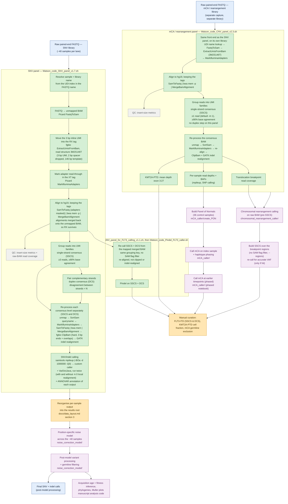

# Pipeline schematic

This diagram shows the TETRIS-seq workflow across both capture panels.
Green boxes are automated (run per sequencing lane / library by the `scripts/*.sh`
entry points). Amber boxes are downstream steps that you trigger manually,
either because they operate across a group of samples or because they require
curation. It renders natively on GitHub.

## How to read it

1. The two panels are **separate captures sequenced as separate libraries**, so each
   starts from its own FASTQ pair, run per lane by the `scripts/*.sh` entry points (green).
2. Both begin with the same front end: the sample and library names are read from the
   UDI index in the FASTQ filename, the reads are converted to an unaligned BAM, the 3 bp
   inline UMI on each read is moved into the RX tag, adapter read-through is marked, and
   the reads are aligned in a single `SamToFastq | bwa mem | MergeBamAlignment` pipe — the
   alignments are merged back onto the unaligned BAM so the UMI tags survive alignment.
   The same round trip is used again on each consensus BAM, since consensus reads are new
   sequences and cannot inherit their input's coordinates.
3. The green boxes are fully scripted: one command per panel produces
   consensus reads and the first-pass calls for every sample on the lane.
4. The amber boxes are triggered by you, after the automated run:
   - the noise model needs the whole group of ~40 samples together;
   - the PON is built once from the 36 controls, then mCAs are called and,
     where present, phased on the index sample and re-called at earlier
     timepoints, all within `mCA_caller/`;
   - chromosomal rearrangements are called from the raw BAM in
     `chromosomal_rearrangement_caller/` (the panel script only computes
     breakpoint read coverage), then re-quantified on the SSCS BAM if a hit was
     found;
   - final curation (FLT3-ITD requiring both SSCS & DCS, KMT2A-PTD cell
     fraction, mCA germline exclusion) is done by hand, as described in the manuscript.

See [`pipeline_overview.md`](pipeline_overview.md) for the per-step scripts and
[`data_layout.md`](data_layout.md) for input/output directory structure.
